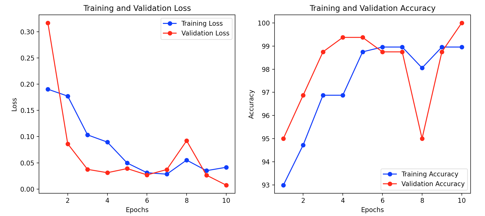

# Ship Detection with ResNet50

## Overview
This project focuses on ship detection using computer vision classification techniques. The primary architecture employed is ResNet50, a deep residual network known for high performance in image classification tasks. The architecture has 50 layers with residual connections, which addresses the vanishing gradient problem, thereby facilitating the training of very deep networks and enhancing overall model accuracy.

## Architecture
The model architecture is based on ResNet50, which includes 50 layers with residual connections. This architecture helps in training deep networks by mitigating the vanishing gradient problem. The final fully connected layer has been modified to output predictions for 2 classes.

## Preprocessing
Images are preprocessed to a size of 224x224 pixels, converted to tensors, and normalised using the mean and standard deviation values specific to the ImageNet dataset.

## Training
The model is trained using a dataset of ship images. The training process includes:
- Data loading and augmentation
- Model initialisation with pre-trained ResNet50 weights
- Training with cross-entropy loss and Adam optimiser
- Validation after each epoch

## MLflow Integration
MLflow is used for experiment tracking and model management. The following details are configured:
- **MLflow URI**: http://localhost:5000
- **Experiment Name**: [RB] [CV] [ship-detection] v1.0

During training, metrics such as loss and accuracy are logged to MLflow. The trained model is also logged and saved locally.

## Results
After training, the model's performance is evaluated on the validation set. The following plot shows the training and validation loss and accuracy over the epochs:



## How to Run
1. Ensure MLflow is running and accessible at the configured URI.
2. Execute the training script:
   ```bash
   python src/train.py
   ```
3. Monitor the training progress and metrics on the MLflow UI.

## Dependencies
- Python 3.10.6
- PyTorch
- torchvision
- PIL
- mlflow
- pytest (for testing)

## Installation
To install the required dependencies, you can use the `setup.py` file provided. Run the following command in the root directory of the project:
```bash
python setup.py install
```
